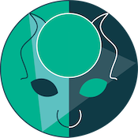

# Project Minotaur



## What am I?
- I am a new prototype for a low-profile, config-light build system for hosting styleguide applications.
- I use Next.js, Babel, PostCSS, and a few other technologies
- I have aspirations of being integrated alongside a headless CMS

Minotaur is designed to build a collection of React components that can support an entire website. At scale, Minotaur should be able to output dozens of components in a predictable, organised way to support a CMS.

Our biggest goal is for Minotaur to use the new JavaScript Services (JSS) of Sitecore 9, making it a half-React, half-Sitecore. Only then will Minotaur realize it's hybrid nature - the Front End of React powered by the Back End of .NET.

## How can I help?
If you have interest in contributing to a lonely, open-soure project please contact me (@CSKingMartin) directly through my Github contact info. You will see a few other contributors come and go, but we are always interested in new ideas!

## Getting Started
Getting an idea of what `project-minotaur` is all about, just do the following:

1. Clone this repository.
2. Travel to the root directory of `project-minotaur` and run:
```
yarn
yarn dev
```
OR if you choose to use NPM, please run the equivalent:
```
npm install
npm run dev
```
3. Travel to `https://localhost:3000` and bear witness!

It's as simple as that.

As of now, Minotaur is no longer near finished, but the `master` branch will be kept clean. We will have periodic merges made from `dev` into `master` at key benchmarks, or at discretion.

## Proto Sitemap
You can see a prototype of the sitemap [here](https://www.gloomaps.com/Z62rEConPy).

MIT License 2019
